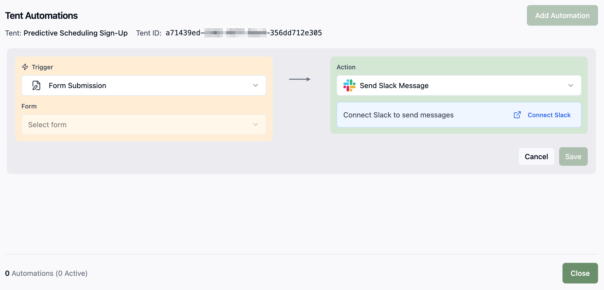

## Tent Details Overview

The tent details page provides a comprehensive view of your tent's information, status, and management options. This is your central hub for understanding and controlling your tent.

    

## Page Layout

### Header Section

The header displays essential tent information:

- **Tent Name**: Click to edit/rename your tent
- **Status Badge**: Shows the current status
  - **Draft**: The tent is being created or edited
  - **Published**: The tent is live on the web
  - **Generating**: AI is creating or updating the tent content
  - **Archived**: The tent is archived and not publicly accessible
- The unique **URL** for the tent

### Action Buttons

<AccordionGroup>
  <Accordion icon="edit" title="Edit">
    Opens the tent editor where you can make changes through chat or direct code editing.
  </Accordion>

   <Accordion icon="MoreVertical" title="Tent Actions">
    Opens the **Tent Actions** dropdown menu.
  </Accordion>
  
  <Accordion icon="eye" title="Preview">
    Opens a preview window to see how your tent looks on the web.
  </Accordion>

  <Accordion icon="Database" title="View Form Submissions">
    Opens a window to view form submission data and download a CSV file.
  </Accordion>

  <Accordion icon="Slack" title="Manage Automations">
    Opens a window to view and add automations. Use this area to set up form submission notifications in Slack or Teams.

    
  </Accordion>

  <Accordion icon="code" title="Download Code">
    Downloads the code for the tent to your device.
  </Accordion>

  <Accordion icon="copy" title="Clone">
    Creates a copy of your tent for variations or A/B testing.
  </Accordion>
  
  <Accordion icon="unplug" title="Unpublish">
    Unpublishes your tent from the web.
  </Accordion>

  <Accordion icon="pencil" title="Rename">
    Opens a window for renaming the tent. You can also double-click the tent name in the header to rename it.
  </Accordion>

  <Accordion icon="Trash2" title="Delete">
    Deletes the tent.
  </Accordion>
  
</AccordionGroup>

## Information Tiles

The tent details page is organized into several tiles, each providing specific information about your tent. A preview of the tent appears near the top left.

### Tent Details
- **Tent ID**: Unique identifier for the tent, which you can copy by hovering and selecting **Copy ID**
- **Created**: Timestamp of when the tent was created
- **Tent Visibility**: Whether the tent is Public or Private
- **Last Updated**: Timestamp of the most recent changes
- **Created By**: User who originally created the tent
- **Total Generations**: Number of generations created for this tent
- **Original Prompt**: Initial prompt used to generate the tent, which you can expand and copy by hovering and selecting the **expand icon**

### Other Tiles

- **Page Views**: Total number of page views in the last 7 days and a **View Tent Analytics** button for more details
- **Form Submissions**: Form submission count and a **View Form Data** button for viewing and downloading data
- **Automations**: The automations set up for this tent and an **Add Automation** button to create new ones

<Card
  title="Next: Understanding the Tent Editor"
  icon="arrow-right"
  href="/working-with-tents/understanding-tent-editor"
>
  Learn how to navigate and use the tent editor interface.
</Card>
