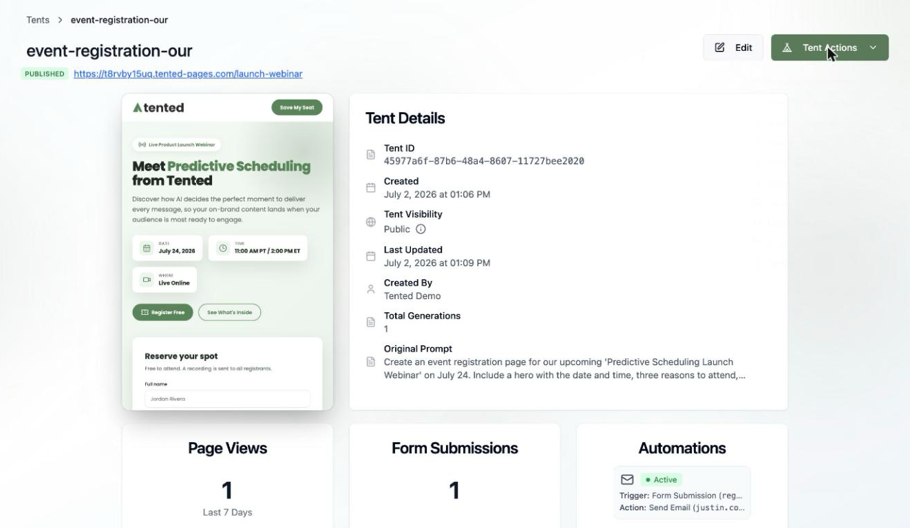
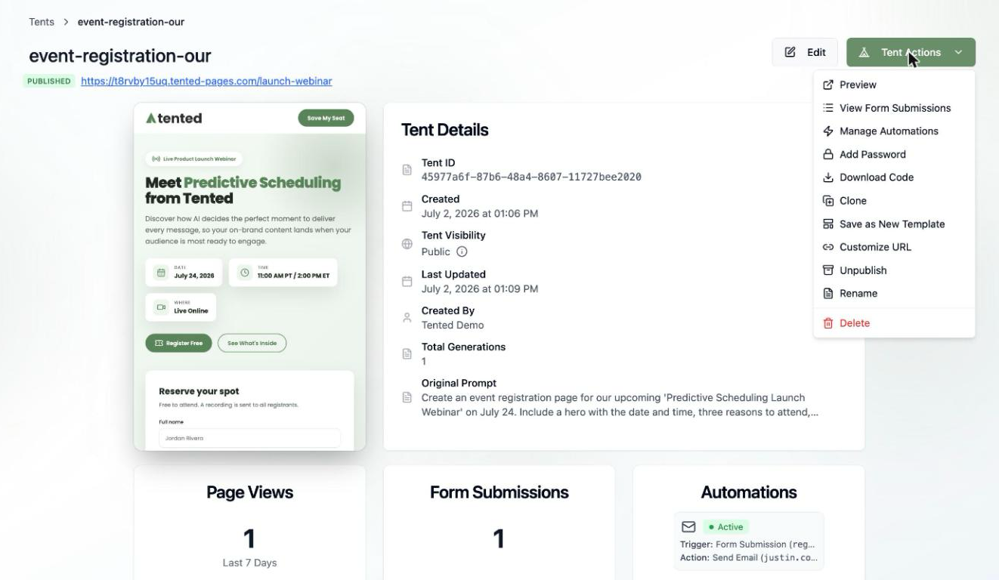
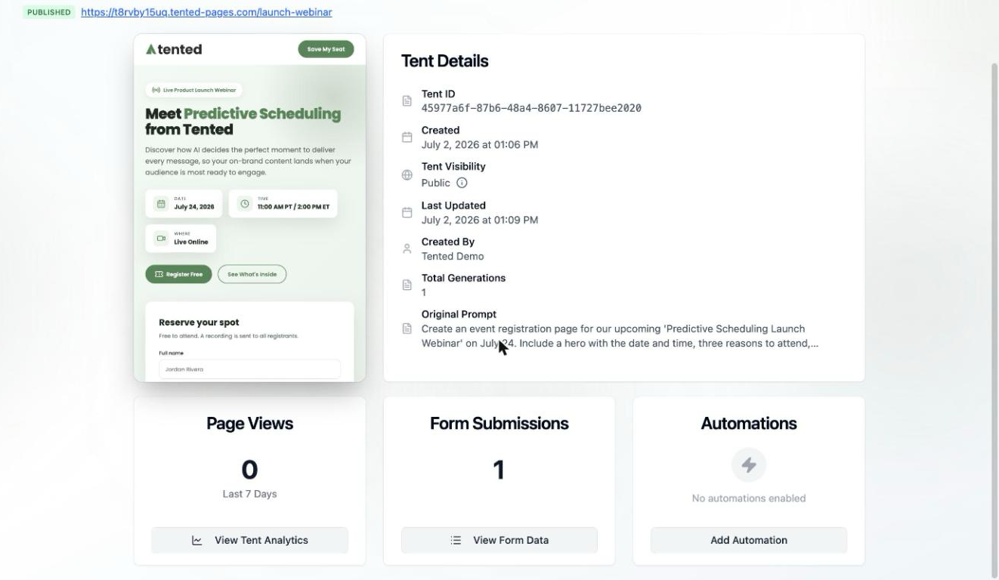
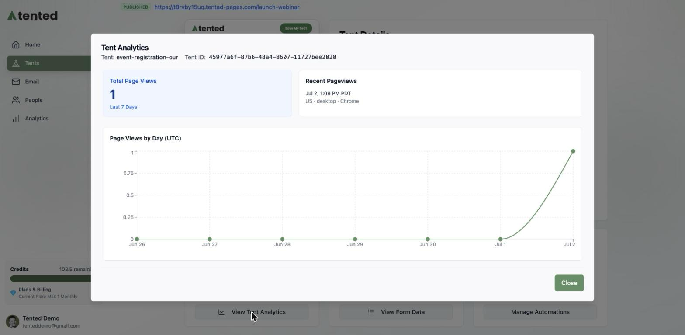

## Tent Details Overview

The **Tent Details** page provides a comprehensive view of your tent's information, status, and management options. This is your central hub for understanding and controlling your tent. Open it from the **Tents** page by clicking any tent's name.

## Page Layout

### Header Section

The header displays essential tent information:

- **Tent Name**: The name of the tent. Double-click it to rename the tent.
- **Status Badge**: **Draft** (being created or edited) or **Published** (live on the web).
- **Live URL**: Shown when the tent is published — click it to open the live page.

### Action Buttons

- **Edit**: Opens the [tent editor](/working-with-tents/understanding-tent-editor), where you make changes through chat or direct code editing.
- **Tent Actions**: A dropdown with everything else:

| Action | What it does |
|---|---|
| **Preview** | See how your tent looks on the web |
| **View Form Submissions** | View and export [form data](/working-with-tents/viewing-form-submissions) |
| **Manage Automations** | Set up [form automations](/working-with-tents/form-automations) — Slack, Teams, email, webhooks |
| **Add Password** | Password-protect the published page |
| **Download Code** | Download the tent's code |
| **Clone** | Copy the tent for variations or A/B testing |
| **Save as New Template** | Turn this tent into a reusable template |
| **Customize URL** | Change the published URL slug |
| **Unpublish** | Take the tent off the web |
| **Rename / Delete** | Housekeeping |

## Information Tiles

### Tent Details

- **Tent ID**: Unique identifier (hover to **Copy ID**) — you'll use this with the [API](/api-reference/introduction)
- **Created / Last Updated**: Timestamps
- **Tent Visibility**: Public or Private
- **Created By**: Who made it
- **Total Generations**: How many AI generations this tent has been through
- **Original Prompt**: The prompt that started it all (hover to expand and copy)

### Activity Cards

Across the bottom you'll find three live cards:

- **Page Views** — traffic for the last 7 days, with **View Tent Analytics** for the full picture: recent pageviews (with location, device, and browser) and a views-by-day chart.
- **Form Submissions** — total submissions, with **View Form Data** to [inspect and export them](/working-with-tents/viewing-form-submissions).
- **Automations** — your active [form automations](/working-with-tents/form-automations) at a glance, with **Add Automation** to create more.

<Card
  title="Next: Understanding the Tent Editor"
  icon="arrow-right"
  href="/working-with-tents/understanding-tent-editor"
>
  Learn how to navigate and use the tent editor interface.
</Card>
